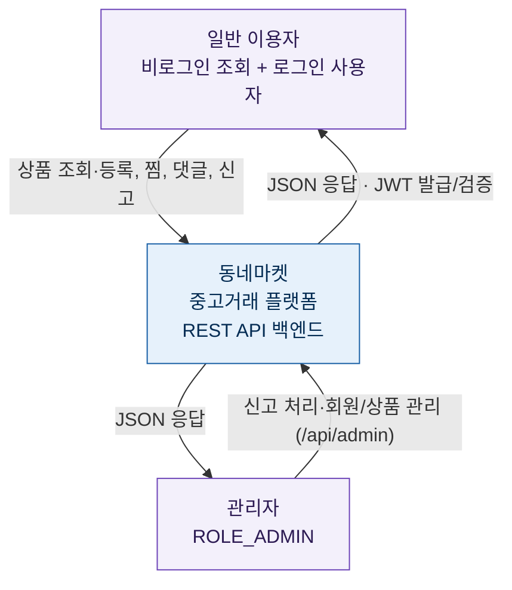

# L1 · 시스템 컨텍스트

동네마켓 시스템이 **누구와 상호작용하는지**를 가장 바깥에서 본 그림. 내부 구조는 다루지 않는다.

## 행위자(Actor)

- **일반 이용자**: 회원가입·로그인 후 상품 등록/수정/삭제, 찜, 댓글, 신고를 한다. 일부 조회(상품 목록·상세, 카테고리, 댓글 조회)는 **비로그인도 가능**하다.
- **관리자(ROLE_ADMIN)**: `/api/admin/**` 경로에 대한 인가 정책이 존재한다(신고 처리·회원/상품 관리 목적). *현재 관리자 기능은 팀장 영역으로 일부 진행 중이며, 관리자 계정 생성 경로(시드/승격)는 아직 없다.*

## 외부 시스템

- 현재 **외부 연동 없음**. 인증은 자체 발급 JWT로 처리하며, 결제·메일·파일 스토리지 등 외부 서비스는 아직 도입 전이다. (도입 시 이 문서에 행위자/시스템을 추가한다.)
