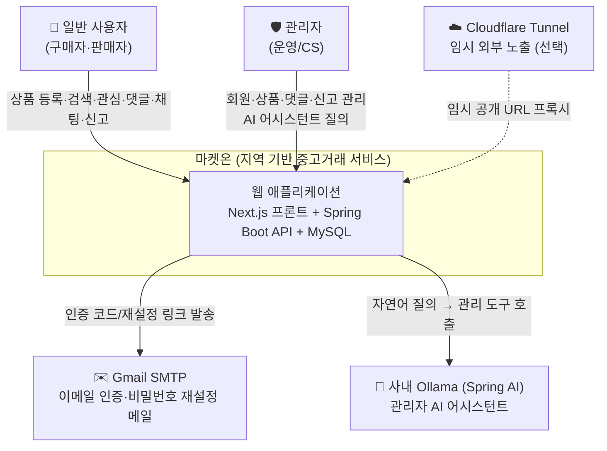

# C4 L1 — 시스템 컨텍스트

> 최종 수정일: 2026-07-07 · 상태: draft

마켓온 시스템의 **경계**를 본다. 누가 사용하고, 어떤 외부 시스템과 연동되는지.

## 액터

| 액터 | 설명 | 주요 행위 |
| --- | --- | --- |
| **일반 사용자** | 지역 기반 중고거래 참여자 (구매자·판매자 겸함) | 회원가입/로그인, 상품 등록·수정·검색, 관심 등록, 댓글, 1:1 채팅, 신고, 알림 수신 |
| **관리자** | 서비스 운영자 | 회원 상태 변경, 상품 숨김/삭제, 댓글 삭제, 신고 처리, 대시보드 조회, **AI 어시스턴트**로 자연어 운영 질의 |

## 외부 시스템 연동

| 외부 시스템 | 용도 | 연동 방식 |
| --- | --- | --- |
| **Gmail SMTP** | 회원가입 이메일 인증, 비밀번호 재설정 메일 발송 | SMTP (`smtp.gmail.com:587`) |
| **사내 Ollama** | 관리자 AI 어시스턴트 — 자연어로 운영 데이터 조회/조치 | Spring AI → Ollama, Tool Calling으로 admin 기능 호출 |
| **Cloudflare Tunnel** | 도메인·토큰 없이 임시 외부 공개 URL (시연·공유용) | Quick Tunnel, `edge` 프로파일에서만 |

## 범위 밖 (경계)

- 결제/정산: 미포함 (거래는 상태값 `ON_SALE → RESERVED → COMPLETED` 관리까지)
- 지도/위치 API: 지역은 문자열 기반(`region`) + 지역 사전 테이블(`regions`)로 처리, 외부 지도 서비스 미연동
- 팀 협업·기획 문서: 코드와 함께 바뀌지 않으므로 Notion/위키 (이 저장소 밖)

> 컨테이너 단위 구성은 [02-container.md](02-container.md) 참고.
