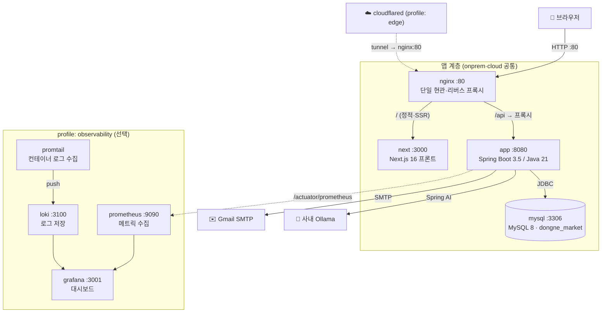

# C4 L2 — 컨테이너

> 최종 수정일: 2026-07-07 · 상태: draft

배포 단위(컨테이너)와 통신 경로. 컨테이너 구성 자체는 배포 지형이 달라도 같다 — **dev**는 루트 [`docker-compose.yml`](../../docker-compose.yml)(MySQL만), **전체 스택**은 [`infra/onprem/`](../../infra/onprem/)(온프레미스)·[`infra/cloud/`](../../infra/README.md)(클라우드)에 정의한다.

## 컨테이너 목록

| 컨테이너 | 이미지 | 포트 | 프로파일 | 역할 |
| --- | --- | --- | --- | --- |
| **nginx** | `nginx:1.27-alpine` | `80:80` | 앱(기본) | 단일 origin 현관. `/`→next, `/api`→app 프록시 |
| **next** | (빌드) `frontend/` | expose 3000 | 앱(기본) | Next.js 16 프론트 (App Router, SSR) |
| **app** | (빌드) `backend/` | expose 8080 | 앱(기본) | Spring Boot REST API |
| **mysql** | `mysql:8.0` | `3306:3306` | (기본) | 데이터 저장. DB `dongne_market`, utf8mb4 |
| **prometheus** | `prom/prometheus:v2.53.2` | `9090` | observability | 메트릭 수집(7d 보존) |
| **grafana** | `grafana/grafana:11.1.4` | `3001:3000` | observability | 메트릭·로그 대시보드 |
| **loki** | `grafana/loki:3.1.1` | `3100` | observability | 로그 저장 |
| **promtail** | `grafana/promtail:3.1.1` | — | observability | 컨테이너 로그 → loki |
| **cloudflared** | `cloudflare/cloudflared` | — | edge | 임시 외부 URL(Quick Tunnel) |

## 실행 모드 (프로파일 조합)

| 모드 | 명령 | 구성 |
| --- | --- | --- |
| **dev** (매일 개발) | 루트에서 `docker compose up -d --wait` | mysql만 컨테이너, app·next는 호스트에서 직접 실행 |
| **온프레미스** | `infra/onprem/`에서 `docker compose --env-file .env up -d --build` | nginx+next+app+mysql |
| **+관측** | `... --profile observability ...` | 위 + Prometheus·Loki·Grafana |
| **+외부노출** | `... --profile edge ...` | 위 + Cloudflare 퀵터널 |

> 실행 절차의 상세는 루트 [README.md](../../README.md) 참고.

## 핵심 설계 결정

- **단일 origin (nginx 현관 하나)**: 브라우저는 항상 한 origin만 호출하고 `/api`는 nginx가 프록시한다. 그래서 **CORS 설정이 없다**. dev 모드에서는 Next dev 서버가 같은 역할(`/api`→:8080 프록시)을 한다.
- **app은 외부 미노출**: `expose`만 하고 `ports` 매핑 없음 → nginx 통해서만 접근.
- **관측·엣지는 선택 프로파일**: 개발 기본 경로를 가볍게 유지.
- **영속 볼륨**: mysql 데이터, 업로드 이미지(`dongne-uploads` — 신고 증빙·상품 공용)는 볼륨으로 컨테이너 재시작에도 유지.

> 백엔드 내부(도메인/계층)는 [03-component.md](03-component.md) 참고.
