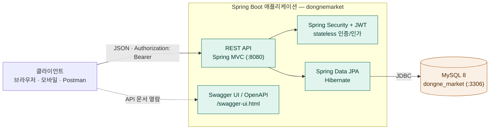

# L2 · 컨테이너 구성 (시스템 구성도)

시스템을 이루는 **실행 단위와 데이터스토어**, 그리고 그 사이의 통신을 본다. 한국 실무에서 "시스템 구성도"라고 할 때 보통 이 그림을 가리킨다.

## 컨테이너

| 컨테이너 | 기술 | 책임 |
| --- | --- | --- |
| 애플리케이션 | Spring Boot 3.5.15 / Java 21 | REST API, 인증/인가, 도메인 로직 |
| 데이터베이스 | MySQL 8.0 | 영속 데이터 저장 (운영·개발) |
| (테스트 전용) | H2 in-memory | 테스트 시 DB 대체 |
| API 문서 | springdoc-openapi (Swagger UI) | `/swagger-ui.html`, `/v3/api-docs` |

## 통신·인증

- 클라이언트 ↔ 앱: HTTP/JSON. 인증은 `Authorization: Bearer <JWT>` 헤더 기반(stateless, 서버 세션 없음).
- 앱 ↔ DB: JDBC (MySQL Connector/J).

## 실행·환경 (로컬 기준)

- **로컬 MySQL**: `backend/docker-compose.yml` (`docker compose up -d`) — DB `dongne_market`, 포트 3306.
- **환경변수 주입 지점**(`application.yml`): `DB_URL`·`DB_USERNAME`·`DB_PASSWORD`, `JWT_SECRET`, `JWT_ACCESS_TTL`(기본 3600초). 미주입 시 로컬 개발 기본값으로 폴백한다(운영 배포 시 `JWT_SECRET` 주입 필수).
- `spring.jpa.hibernate.ddl-auto=update` — 엔티티 기준으로 스키마를 자동 반영(초기 개발 편의, 운영 전 `validate` 권장). `open-in-view=false`.

> 현재는 **단일 모놀리식** 구성이다. 추후 모듈화·분리 시 이 그림을 우선 갱신한다(상위 레벨이라 변경 빈도가 낮다).
