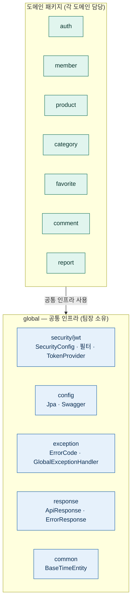
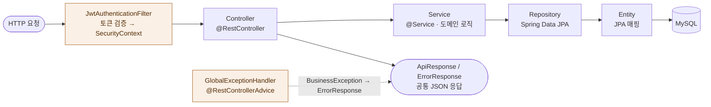

# L3 · 애플리케이션 구조

애플리케이션(컨테이너) **내부**를 본다: 패키지 구성과, 요청이 레이어를 통과하는 경로.

## 패키지 구성 — 도메인별 + 공통(global)

각 도메인 패키지는 동일한 내부 구성을 따른다: `controller` · `service` · `repository` · `dto` · `entity`.

## 요청 처리 흐름 (레이어드)

## 핵심 규칙

- **레이어드**: Controller → Service → Repository → Entity. 컨트롤러는 얇게, 트랜잭션·도메인 로직은 서비스에 둔다.
- **공통 응답**: 성공은 `ApiResponse`, 실패는 `GlobalExceptionHandler`가 `BusinessException`(+`ErrorCode`)을 공통 `ErrorResponse` JSON으로 변환한다.
- **인증/인가**: `global/security`의 필터·정책이 횡단으로 적용된다. `global` 영역은 **팀장만 수정**한다. 상세 인가 정책은 `SecurityConfig` 참조.
- **공통 매핑**: 시각 필드(`createdAt`/`updatedAt`)는 `BaseTimeEntity` 상속으로 자동 관리된다.
