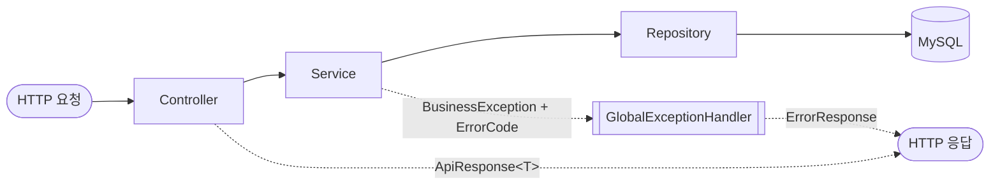
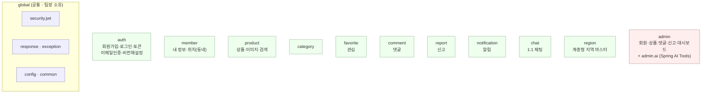

# C4 L3 — 컴포넌트 (백엔드)

> 최종 수정일: 2026-07-28 · 상태: draft

`app` 컨테이너(Spring Boot) 내부 구조. **도메인별 패키지 + 계층형(Controller·Service·Repository)** 이다.
패키지 루트: `com.dongnemarket`.

## 계층 규칙

- **Controller**: 요청 수신·`@Valid`·Service 호출·`ApiResponse` 반환·Swagger. 비즈니스 로직 없음.
- **Service**: 비즈니스 로직·권한/중복/상태 검증·트랜잭션·DTO 변환. 예외는 `BusinessException(ErrorCode)`.
- **Repository**: Spring Data JPA, DB 접근만.
- **Entity/DTO**: Entity는 응답으로 직접 노출하지 않고 Request/Response DTO 분리.

공통 규약은 `global` 패키지가 소유한다: `ApiResponse`, `ErrorResponse`, `BusinessException`, `GlobalExceptionHandler`, JWT 보안(`security.jwt`), JPA Auditing(`BaseTimeEntity`), Swagger 설정.

## 도메인 모듈

| 도메인 | 책임 | 비고 |
| --- | --- | --- |
| **auth** | 회원가입·로그인·로그아웃, JWT 발급/재발급(`refresh_tokens`), 이메일 인증(`email_verifications`), 비밀번호 재설정(`password_reset_tokens`) | Gmail SMTP 연동 |
| **member** | 내 정보 조회/수정/탈퇴(소프트), 비밀번호 변경, 동네(위치) 관리(`member_locations`) | |
| **product** | 상품 CRUD·거래상태 변경·검색/필터, 상품 이미지(`product_images`) | `favoriteCount`·`viewCount` 집계 |
| **category** | 카테고리 조회, 카테고리별 상품 | 초기 데이터 시더 |
| **favorite** | 관심 등록/취소, 내 관심 목록 | 이벤트 발행(아래) |
| **comment** | 댓글 CRUD (소프트 삭제) | |
| **report** | 상품/회원 신고, 증빙 이미지 업로드 | 처리는 admin |
| **notification** | 알림 생성/조회/읽음 — 댓글·가격변경 트리거 | `NotificationType: COMMENT, PRICE_CHANGE` |
| **chat** | 1:1 채팅방(`chat_rooms`)·메시지(`chat_messages`)·읽음 처리 | |
| **region** | 법정동 코드 기반 시-구-동 계층형 지역 마스터. 상품·회원 동네가 FK로 참조하며 API 식별자는 `regionCode` | |
| **admin** | 회원 상태 변경, 상품 숨김/삭제, 댓글 삭제, 신고 처리, 대시보드 | `ROLE_ADMIN` 전용 |
| **admin.ai** | 관리자 AI 어시스턴트 — 자연어 질의를 위 admin 기능으로 Tool Calling | Spring AI + Ollama |

## 도메인 간 협력 — 이벤트

강결합을 피하려고 일부는 **애플리케이션 이벤트**로 연결한다.

- `FavoriteAddedEvent` / `FavoriteRemovedEvent` (favorite) → `ProductFavoriteCountHandler` (product): 상품 `favoriteCount` 증감.
- 알림(notification)은 관련 도메인 변화(댓글 작성, 가격 변경)를 계기로 생성된다.

## 인증 / 인가

- **JWT Access Token** 기반. 헤더 `Authorization: Bearer {accessToken}`. 만료 시 `refresh_tokens`로 재발급.
- 비인증 허용: 회원가입·로그인, 상품 목록/상세, 카테고리, 댓글 목록.
- 본인 검증: 상품 수정/삭제/거래상태(작성자), 댓글 수정/삭제(작성자), 관심 취소(등록자).
- `ROLE_ADMIN`: `/api/admin/**`.

> 데이터 모델은 [04-erd.md](04-erd.md) 참고.
