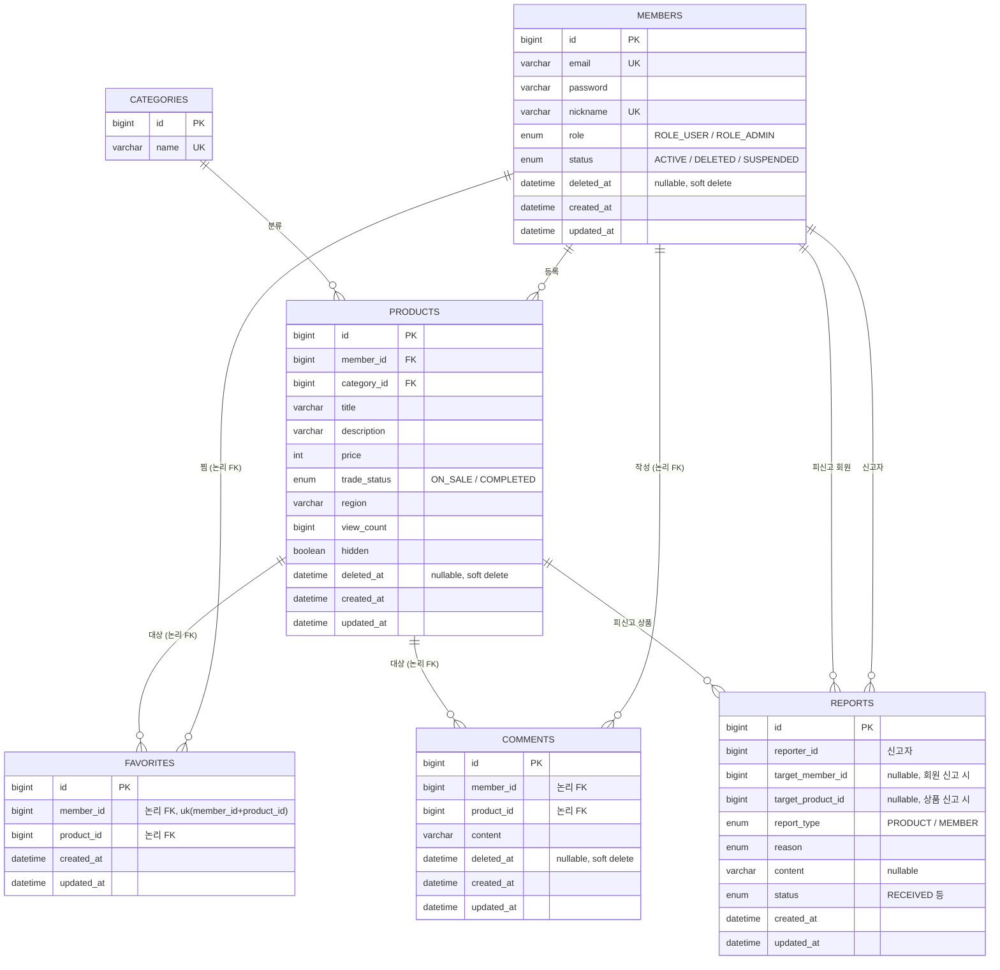

# 데이터 모델 (ERD)

JPA 엔티티 기준 테이블 구조와 관계. 스키마는 `ddl-auto=update`로 엔티티에서 자동 생성된다.

## 관계 표현 방식 — 중요한 설계 결정

- **`products`만 JPA 연관관계**(`@ManyToOne`)로 `members`·`categories`를 참조한다 → 물리적 외래키(FK) 생성.
- **`favorites`·`comments`·`reports`는 `Long` ID 참조**(논리 FK)다. 엔티티 객체 대신 `member_id`/`product_id` 같은 ID 값만 저장하고 JPA 연관관계를 두지 않는다 → 도메인 간 결합도를 낮추는 의도적 선택.
- 따라서 위 ERD의 일부 관계선은 **DB 제약이 아니라 애플리케이션 레벨의 논리적 관계**다.

## 공통 규칙

- **시각 필드**: `categories`를 제외한 모든 테이블이 `BaseTimeEntity`를 상속해 `created_at`/`updated_at`을 자동 관리한다.
- **소프트 삭제**(`deleted_at`): `members`(+`status=DELETED`), `products`, `comments`. 물리 삭제 대신 표시만 한다.
- **유니크 제약**: `members.email`, `members.nickname`, `categories.name`, `favorites(member_id, product_id)`.
