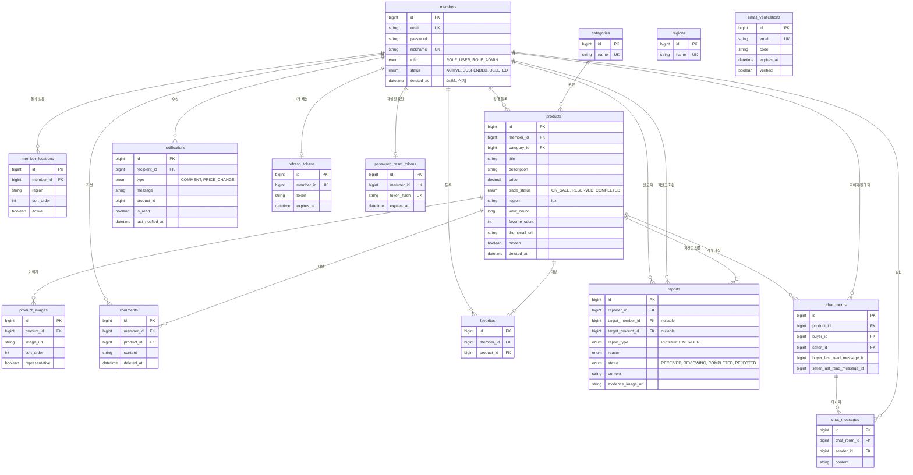

# 데이터 모델 (ERD)

> 최종 수정일: 2026-07-07 · 상태: draft
> 정본은 JPA 엔티티(`backend/.../*/entity`). 스키마가 바뀌면 같은 PR에서 갱신한다. 감사 컬럼 `created_at`·`updated_at`은 `BaseTimeEntity`로 공통 상속(도표에서는 생략).

## 테이블 요약

| 테이블 | 도메인 | 핵심 규칙 |
| --- | --- | --- |
| `members` | member/auth | `email`·`nickname` UNIQUE. 탈퇴는 `status=DELETED` + `deleted_at` 소프트 삭제. 비번 BCrypt |
| `member_locations` | member | 회원의 동네(지역) 목록. `active`·`sort_order`로 대표/정렬 |
| `categories` | category | 상품 분류. 초기 데이터 시더로 채움 |
| `regions` | region | 지역 사전(자동완성·검증). `members`/`products`의 `region` 문자열과 별개 사전 |
| `products` | product | 작성자만 수정/삭제/거래상태 변경. `hidden`·`deleted_at`은 목록 제외. `region` 인덱스 |
| `product_images` | product | 상품별 다중 이미지. `representative` 대표 이미지 |
| `comments` | comment | 소프트 삭제(`deleted_at`). 목록 조회는 비로그인 허용 |
| `favorites` | favorite | `(member_id, product_id)` UNIQUE — 중복 관심 방지 |
| `reports` | report | 상품 신고=`target_product_id`, 회원 신고=`target_member_id` (둘 중 하나). 증빙 이미지 |
| `notifications` | notification | 수신자별 알림. 댓글·가격변경 계기로 생성 |
| `chat_rooms` / `chat_messages` | chat | 상품 기준 구매자↔판매자 1:1 방. 방별 마지막 읽은 메시지 id로 안읽음 계산 |
| `refresh_tokens` | auth | 회원당 1개(`member_id` UNIQUE) |
| `email_verifications` / `password_reset_tokens` | auth | 이메일 인증 코드 / 재설정 토큰(해시 저장), 만료 시각 관리 |

## 참고

- `refresh_tokens`·`password_reset_tokens`의 `member_id`는 JPA 연관관계가 아니라 **값(Long)으로 참조**한다(느슨한 결합). 도표에서는 논리 관계로 표시.
- `email_verifications`는 회원 생성 전 단계라 `email` 문자열 기준으로 독립 존재(members와 FK 없음).
- `products.region`·`member_locations.region`은 문자열이고, `regions` 테이블은 입력 보조용 사전이다(FK 강제 아님).
