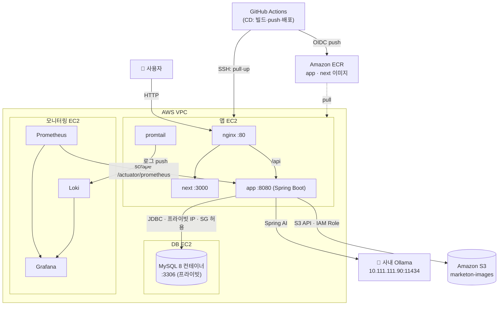

# 배포 토폴로지 (AWS)

> 최종 수정일: 2026-07-08 · 상태: draft

로컬(docker-compose)이 아닌 **AWS 클라우드 배포**의 물리 구성. 로컬 컨테이너 구성은 [02-container.md](02-container.md), 배포 절차는 [runbook/cloud-deploy.md](../runbook/cloud-deploy.md) 참고.

## EC2 3대 구성

| EC2 | 컨테이너 | 폴더 | 역할 |
| --- | --- | --- | --- |
| **앱 EC2** | nginx · next · app · promtail | [`infra/cloud/app/`](../../infra/cloud/app/) | 사용자 트래픽 처리. 이미지는 ECR pull |
| **DB EC2** | mysql | [`infra/cloud/db/`](../../infra/cloud/db/) | **MySQL 8 컨테이너 자체 호스팅** (관리형 RDS 아님 — [ADR 0002](../adr/0002-db-hosting-ec2-mysql.md)) |
| **모니터링 EC2** | prometheus · loki · grafana | [`infra/cloud/monitoring/`](../../infra/cloud/monitoring/) | 앱 메트릭 scrape, 로그 수집, 대시보드 |

각 EC2에는 `infra/cloud/<역할>/` 폴더만 올리고 그 안에서 `docker compose --env-file .env up -d`.

## 네트워킹

- **단일 VPC** 안에 3대. **DB EC2는 퍼블릭 IP 없이** 같은 VPC의 앱 EC2만 **Security Group**으로 3306 허용.
- 앱은 `DB_URL`에 **DB EC2의 프라이빗 IP**를 넣어 접속.
- 사용자 진입은 앱 EC2의 nginx(:80) 단일 현관 → `/`는 next, `/api`는 app (로컬과 동일 구조, CORS 없음).

## 이미지 파이프라인

- GitHub Actions가 `backend/`·`frontend/` 이미지를 빌드해 **ECR로 push**(OIDC 인증)하고, 이어서 **앱 EC2에 SSH로 접속해 pull·재기동**까지 자동화한다.
- 상세는 [runbook/ci-cd.md](../runbook/ci-cd.md).

## 파일 저장소

- 신고 증빙 이미지·상품 이미지는 `file.storage.type`(env: `FILE_STORAGE_TYPE`) 값으로 저장소를 고른다 — 프로파일이 아니라 이 값 하나로 구현체가 갈린다(`global/storage` 참고).
  - **앱 EC2(이 문서의 배포 대상)**: `FILE_STORAGE_TYPE=s3` 고정, **Amazon S3**(`ap-northeast-2`)에 저장.
  - 온프레미스/로컬 docker-compose 배포는 `FILE_STORAGE_TYPE=local`(기본값)로 볼륨 마운트된 로컬 디스크를 그대로 쓸 수 있다. `test` 프로파일도 항상 로컬 디스크를 쓴다(외부 AWS 불필요).
- **자격증명은 코드/환경변수로 주입하지 않는다.** 앱 EC2에 S3 접근 권한이 있는 **IAM Role**을 붙여 AWS SDK 기본 자격증명 체인이 자동으로 사용한다.
- 앱 컨테이너에는 `FILE_STORAGE_TYPE`, `AWS_S3_BUCKET`, `AWS_REGION` 환경변수만 주입한다(`infra/cloud/app/docker-compose.yml`).
- **프록시 방식**: 이미지 조회 API(`GET /api/products/images/{filename}`, `GET /api/reports/evidence-image/{filename}`)는 서버가 저장소(S3 또는 로컬 디스크)에서 읽어 그대로 응답한다. DB에는 실제 저장 위치가 아니라 기존 내부 API 경로만 저장되어 프론트/DB 스키마 영향이 없다.

## as-built 특이사항 (주의)

- **앱 EC2는 `SPRING_PROFILES_ACTIVE=prod`** 로 기동한다(온프레미스 배포와 공유하는 운영 수위 — [ADR 0004](../adr/0004-infra-boundary.md)). 다만 현재 `prod`도 `ddl-auto: update`라 **운영 스키마가 Hibernate 자동변경**된다 — Flyway 도입 후 `validate` 전환 예정. 관련 위험·후속은 [ADR 0003](../adr/0003-schema-ddl-auto.md).
- **ECR push 이후 앱 EC2 배포는 CD가 SSH로 자동화**(pull·재기동)한다. 단 `:latest` 태그 기준이라 특정 SHA 롤백·헬스체크는 아직 수동이다.
