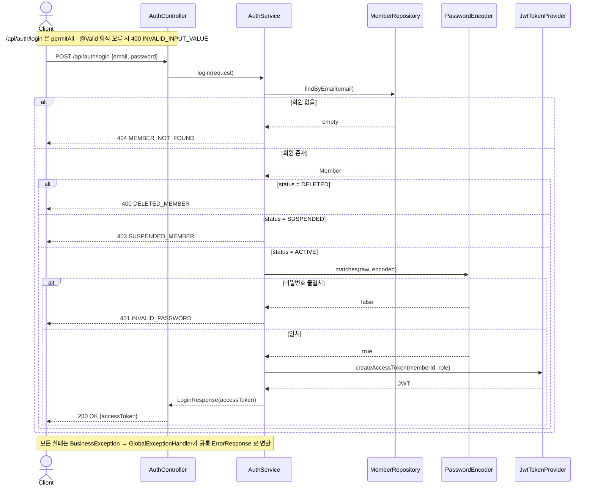
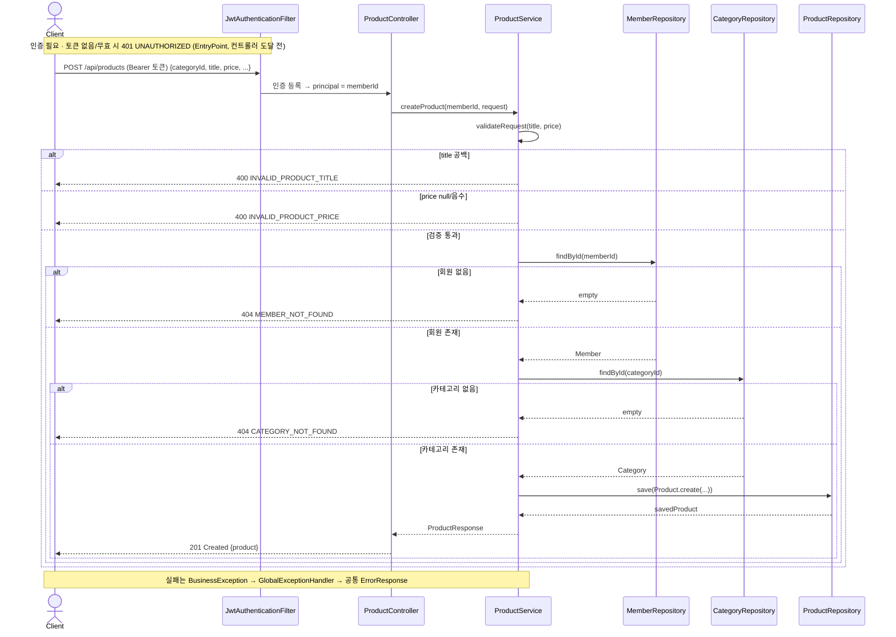

# 핵심 동작 흐름 (시퀀스)

런타임에 요청이 레이어를 **시간순**으로 어떻게 흐르는지 본다. 정적 구조는 [03-application.md](03-application.md), 실패 응답은 공통 `ErrorResponse` JSON으로 통일된다.

---

## 로그인 — `POST /api/auth/login`

### 메모
- `/api/auth/login`·`/signup`은 `permitAll` → 토큰 없이 호출한다. **회원가입은 토큰을 발급하지 않는다**(201만 반환).
- 인증 주체는 `Long memberId`: 토큰 `subject`=memberId, claim=role. 발급된 토큰 검증 시 DB 재조회가 없다(`UserDetailsService` 미사용).
- 따라서 **상태(`status`)·권한(`role`) 변경은 토큰 만료(기본 1시간) 전까지 반영되지 않는다** — 로그인 시점에 확정.

---

## 상품 등록 — `POST /api/products`

### 메모
- 인증 필요. `@AuthenticationPrincipal Long memberId`로 작성자를 식별한다.
- 입력 검증은 컨트롤러 `@Valid`가 아니라 **서비스에서 수동 검증**(`validateProductFields`): 제목 공백 → 400, 가격 `null`/음수 → 400. (로그인과 달리 컨트롤러에 `@Valid`가 없다.)
- `member`·`category`는 조회 실패 시 각각 404. 저장 성공 시 `201 Created`.
- 트랜잭션: 쓰기 메서드는 `@Transactional`, 조회는 클래스 기본 `readOnly=true`. 신규 `Product`는 `ON_SALE`·`viewCount=0`·`hidden=false`로 생성된다([04-erd.md](04-erd.md)).
