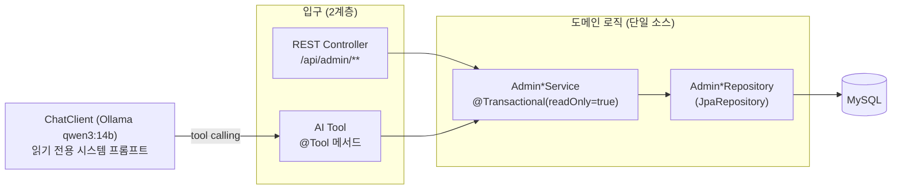
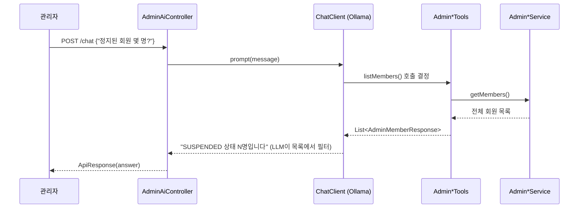

# Admin 모듈 구현 문서 (as-built) — 담당: 팀장

> 현재 `develop`에 머지된 **관리자(admin) 모듈의 구현 그대로**를 정리한 문서다.
> 유즈케이스(요구사항)는 [`docs/usecase/08-admin.md`](../usecase/08-admin.md), 테스트 명세는 [`docs/testing/08-admin.md`](../testing/08-admin.md), 요청/응답 예시는 [`docs/postman/admin-*.md`](../postman/)에 있다.
> 이 문서는 **로직·구조**에 집중하며, 기능 추가 시 여기서 diff 형태로 확장한다.

---

## 1. 개요 · 설계 원칙

관리자 모듈은 **"운영자가 서비스 데이터를 조회하고, 부적절한 콘텐츠·회원을 제재"**하는 백오피스 기능이다. 핵심 설계 원칙은 두 가지다.

1. **운영 가시성 우선** — 관리자 조회는 일반 사용자와 달리 **삭제·숨김·정지 데이터까지 전부 포함**한다. 일반 서비스 API가 필터링하는 것을 관리자는 모두 본다.
2. **2계층 재사용 (Service → REST + AI)** — 비즈니스 로직은 `Admin*Service`에만 둔다. REST 컨트롤러와 AI Tool은 **같은 서비스를 얇게 감싸는 두 개의 입구**일 뿐이다. 이것이 "수동 MVP 로직을 만들고 → tool로 감싸 AI로 자동화"라는 개발 방식의 구조적 표현이다.

**공통 인가**: `SecurityConfig` — `/api/admin/**` 는 전부 `hasRole("ADMIN")`. USER 접근 → 403, 비인증 → 401.
**응답 포맷**: 전 엔드포인트 `ApiResponse<T>` 래핑(공통 구조).

---

## 2. 컴포넌트 인벤토리

| 구분 | 클래스 | 역할 |
| --- | --- | --- |
| Controller | `AdminMemberController` `AdminProductController` `AdminCommentController` `AdminReportController` `AdminDashboardController` | REST 입구 (5) |
| Controller (AI) | `admin.ai.controller.AdminAiController` | 자연어 챗 입구 (1) |
| Service | `AdminMemberService` `AdminProductService` `AdminCommentService` `AdminReportService` `AdminDashboardService` | 도메인 로직 (5) |
| Repository | `AdminMemberRepository` `AdminProductRepository` `AdminCommentRepository` `AdminReportRepository` | 조회/집계 (4, 각 도메인 엔티티 참조) |
| AI Tool | `AdminMemberTools` `AdminProductTools` `AdminCommentTools` `AdminReportTools` `AdminDashboardTools` | 서비스를 `@Tool`로 노출 (5) |
| AI 설정 | `admin.ai.config.AdminAiConfig` | `adminChatClient` 빈 조립 |
| 초기화 | `admin.init.AdminAccountInitializer` | 부팅 시 관리자 계정 시드 |

> 관리자 repository는 각 도메인 엔티티(`Member`/`Product`/`Comment`/`Report`)를 직접 참조한다. 대부분 `JpaRepository` 상속 메서드(`findAll`/`findById`/`count`)만 쓰고, 커스텀은 2개뿐: `AdminCommentRepository.findByIdAndDeletedAtIsNull`, `AdminReportRepository.countByStatus`.

---

## 3. 엔드포인트 & 로직 (구현 그대로)

### 3.1 회원 관리 `/api/admin/members`

| Method | Path | 로직 | 예외 |
| --- | --- | --- | --- |
| GET | `` | `findAll()` → 전체 회원(상태 무관) | — |
| GET | `/{memberId}` | `findById` | 없음 → `MEMBER_NOT_FOUND`(404) |
| PATCH | `/{memberId}/status` | body `{status}` 를 `trim()` 후 `MemberStatus.valueOf` 파싱 → `member.changeStatus()` | null/공백/오타 → `INVALID_MEMBER_STATUS`(400), 회원없음 → `MEMBER_NOT_FOUND` |

- 상태값: `ACTIVE` / `SUSPENDED` / `DELETED` (대소문자 구분 — 소문자 입력 시 400).
- `changeStatus`: `DELETED` 로 바꾸면 `deletedAt=now`, 그 외 상태로 바꾸면 `deletedAt` 클리어(복구 가능).
- 상태 변경 DTO는 `@Valid` 없이 **서비스에서 직접 검증**(`parseStatus`).

### 3.2 상품 관리 `/api/admin/products`

| Method | Path | 로직 | 예외 |
| --- | --- | --- | --- |
| GET | `` | `findAll()` → 숨김·삭제 포함 전체 | — |
| GET | `/{productId}` | `findById` | 없음 → `PRODUCT_NOT_FOUND` |
| PATCH | `/{productId}/hidden` | `product.hide()` — **단방향**(해제 API 없음), 작성자 아니어도 가능 | 없음 → `PRODUCT_NOT_FOUND` |
| DELETE | `/{productId}` | `product.softDelete()` | 없음 → `PRODUCT_NOT_FOUND` |

### 3.3 댓글 관리 `/api/admin/comments`

| Method | Path | 로직 | 예외 |
| --- | --- | --- | --- |
| GET | `` | `findAll()` → 삭제 포함 전체 | — |
| DELETE | `/{commentId}` | `findByIdAndDeletedAtIsNull` → `comment.softDelete()`, 작성자 아니어도 가능 | 없음/**이미 삭제됨** → `COMMENT_NOT_FOUND` |

> 주의: 삭제는 `findByIdAndDeletedAtIsNull` 이라 **이미 삭제된 댓글을 다시 삭제하면 404**. 반면 목록 조회는 삭제분도 보여준다(가시성).

### 3.4 신고 관리 `/api/admin/reports`

| Method | Path | 로직 | 예외 |
| --- | --- | --- | --- |
| GET | `` | `findAll()` → 전체 신고 | — |
| GET | `/{reportId}` | `findById` | 없음 → `REPORT_NOT_FOUND` |
| PATCH | `/{reportId}/status` | `trim`+`ReportStatus.valueOf` → `report.changeStatus()` | null/공백/오타 → `INVALID_REPORT_STATUS` |

- 상태값: `RECEIVED` / `REVIEWING` / `COMPLETED` / `REJECTED`.
- 신고 대상은 `ReportType`(`PRODUCT`/`MEMBER`), 사유는 `ReportReason`(`FAKE_ITEM`/`FRAUD_SUSPECTED`/`PROHIBITED_ITEM`/`INAPPROPRIATE_CONTENT`/`ETC`).

### 3.5 대시보드 `/api/admin/dashboard`

| Method | Path | 집계 내용 |
| --- | --- | --- |
| GET | `` | `totalMembers` `totalProducts` `totalReports` `pendingReports` `totalComments` |

- 각 `count()` 는 **삭제·숨김분까지 포함**한 전체 카운트.
- `pendingReports` = `countByStatus(RECEIVED)` — **`RECEIVED` 상태만** 집계(→ [갭 N3](#6-알려진-갭-확장-포인트)).

### 3.6 AI 어시스턴트 `/api/admin/ai` (읽기 전용)

| Method | Path | 로직 |
| --- | --- | --- |
| POST | `/chat` | body `{message}` → `trim`(공백 시 `INVALID_INPUT_VALUE`) → `adminChatClient` 가 tool 호출 후 자연어 답변 |

`AdminAiConfig.adminChatClient` 조립:
- **시스템 프롬프트**: "관리자 데이터 조회 도우미", 규칙 = ①데이터 질문엔 반드시 tool 호출(추측 금지) ②**읽기 전용**(정지·삭제·상태변경 요청은 거부하고 "관리자 화면에서 직접" 안내) ③한국어 간결 ④역할 이탈 금지.
- `disableThinking()` — qwen3 계열은 thinking이 기본 활성이라 최종 답변이 새어 `content`가 비는 문제(2026-07-02 실측) → **필수**.
- `defaultTools` 5종 등록.

---

## 4. AI Tool 카탈로그

| Tool 클래스 | `@Tool` 메서드 | 위임 대상 | 파라미터 |
| --- | --- | --- | --- |
| `AdminMemberTools` | `listMembers` / `getMember` | `AdminMemberService` | (—) / `memberId` |
| `AdminProductTools` | `listProducts` / `getProduct` | `AdminProductService` | (—) / `productId` |
| `AdminReportTools` | `listReports` / `getReport` | `AdminReportService` | (—) / `reportId` |
| `AdminCommentTools` | `listComments` | `AdminCommentService` | (—) |
| `AdminDashboardTools` | `getDashboard` | `AdminDashboardService` | (—) |

**설계 규칙**: Tool에는 비즈니스 로직을 두지 않고 서비스에 **위임만** 한다. 상태변경/삭제 Tool은 **의도적으로 없다**(어시스턴트 읽기 전용).

> 현재 tool은 **필터 없는 `listXxx` 전량 조회**뿐이라, LLM이 "정지 회원만" 같은 조건을 **응답 목록에서 직접 걸러야** 한다. 데이터가 커지면 프롬프트 토큰·정확도가 나빠진다(→ 확장 포인트).

---

## 5. 초기 데이터 · 응답 스키마

**관리자 계정 시드** (`AdminAccountInitializer`, `@Profile("!test")`)
- 부팅 시 `admin@dongnemarket.com` / `admin1234!` / 닉네임 `관리자` 를 `Member.createAdmin(...)` 으로 1개 생성.
- `existsByEmail` 로 **멱등**(이미 있으면 skip). 비밀번호는 BCrypt 인코딩.

**응답 DTO 필드** (모두 불변 + 정적 팩토리 `from`/`of`)

| DTO | 필드 |
| --- | --- |
| `AdminMemberResponse` | memberId, email, nickname, role, status, createdAt, deletedAt |
| `AdminProductResponse` | productId, memberId, categoryId, title, description, price, tradeStatus, region, viewCount, hidden, deletedAt, createdAt |
| `AdminCommentResponse` | commentId, memberId, productId, content, deletedAt, createdAt |
| `AdminReportResponse` | reportId, reporterId, targetMemberId, targetProductId, reportType, reason, content, status, createdAt |
| `AdminDashboardResponse` | totalMembers, totalProducts, totalReports, pendingReports, totalComments |

---

## 6. 알려진 갭 · 확장 포인트

기능 추가 시 이 목록을 기준선으로 삼는다. (테스트 전략 §8 기준, "KNOWN GAP 고정" 방침)

| ID | 내용 | 위치 | 성격 |
| --- | --- | --- | --- |
| **N1** | 관리자가 **다른 관리자·본인**을 정지/삭제 가능 (가드 없음) | `AdminMemberService.changeMemberStatus` | 버그성(정책 미결정) |
| **N2** | 상태 변경(정지/삭제)이 **기존 발급 JWT를 무효화하지 못함** — 로그인 시점에만 상태 검사 | member 도메인 / 보안 | 버그성 |
| **N3** | 대시보드 `pendingReports` 가 `RECEIVED` 만 집계(`REVIEWING` 누락) | `AdminDashboardService` L37 | 집계 정확도 |
| G-list | 관리자 조회에 **목록 필터·검색·페이징 없음** (`findAll` 전량) | 전 도메인 GET `` | 확장(REST + AI Tool 공통 이득) |
| G-report | 신고 처리와 **대상 제재(숨김/정지)가 분리**됨 (원자적 워크플로 없음) | report ↔ member/product | 확장 |
| G-audit | 관리자 조치 **이력(감사 로그) 없음** — 누가·언제·왜 조치했는지 미기록 | 전 액션 | 확장 |
| G-count | 대시보드 카운트에 **삭제·숨김분 포함** (순수 활성 수치 구분 없음) | dashboard | 정의 명확화 |

> **확장 시 재사용 규칙**: 새 로직은 `Admin*Service` 에 추가하고 → REST 엔드포인트와 `@Tool` 을 **둘 다** 얇게 붙인다. 그래야 "수동 → AI 자동화" 파이프라인이 유지된다.
