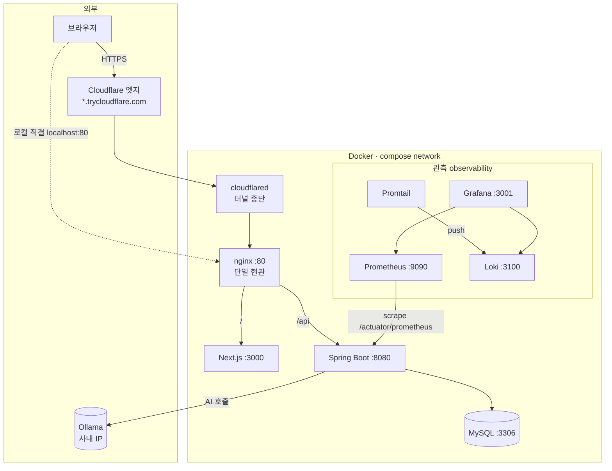

# 로컬 배포용(local-deploy) 실행 런북

로컬 한 대에서 **프론트·백엔드·DB·관측·외부노출까지 전부 Docker로** 띄우는 "로컬 배포형" 환경 가이드.
운영 패리티 확인·시연·팀 공유용이다. (실제 AWS 배포는 [README](README.md), 빠른 개발 루프는 §7 dev 모드 참고)

> 요약: `.env` 준비 → 백엔드 JAR 빌드 → `docker compose --profile ... up`. 브라우저는 **nginx(:80) 한 곳**만 보므로 CORS 설정이 없다.

---

## 1. 구성 (3개 프로파일)

| 프로파일 | 올라오는 것 | 용도 |
|---|---|---|
| `web` | nginx · Next.js · Spring Boot · MySQL | 앱 본체 (필수) |
| `observability` | Prometheus · Loki · Promtail · Grafana | 지표·로그 수집/조회 |
| `edge` | cloudflared | Cloudflare 퀵터널로 임시 외부 URL |

프로파일은 **겹쳐서** 켠다. 예) `--profile web --profile observability --profile edge`.

### 아키텍처



- 컨테이너끼리는 **서비스 이름**(`app`, `mysql`, `loki`…)으로 통신한다.
- nginx가 유일한 현관: `/`→Next, `/api`→Spring. 로컬이든 터널이든 결국 nginx로 모여 **same-origin → CORS 불필요**.
- Grafana·Prometheus는 호스트 포트(3001/9090)로만 열리고 **터널에는 실리지 않음**(외부 비노출).

---

## 2. 사전 준비

- **Docker Desktop** (WSL2 백엔드 권장)
- **JDK 21** — 앱 이미지는 빌드된 JAR를 COPY만 하므로 **로컬에서 먼저 빌드**해야 함(서버 빌드 안 함)
- 리포 **루트에서** 실행 (compose 파일이 루트에 있음)

### `.env` 만들기

루트의 `.env.example`을 복사해 `.env` 생성(값은 로컬용 기본으로 둬도 됨):

```bash
cp .env.example .env
```

| 키 | 설명 |
|---|---|
| `MYSQL_ROOT_PASSWORD` / `DB_USERNAME` / `DB_PASSWORD` | MySQL 계정 |
| `JWT_SECRET` | JWT 서명 키 |
| `GRAFANA_ADMIN_USER` / `GRAFANA_ADMIN_PASSWORD` | Grafana 로그인 |

> `.env`는 gitignore 대상. Ollama 주소를 바꾸려면 app 환경에 `OLLAMA_BASE_URL`을 넣는다(기본 사내 IP).

---

## 3. 실행

### 3-1. 백엔드 JAR 빌드 (필수 선행)

```bash
cd backend && ./gradlew clean build -x test && cd ..
```

> 이걸 안 하면 app 이미지 빌드가 실패한다(`build/libs/*.jar` 없음).

### 3-2. 프로파일별 기동

```bash
# ① 앱만 (최소)
docker compose --profile web up -d --build

# ② 앱 + 관측
docker compose --profile web --profile observability up -d --build

# ③ 앱 + 관측 + 외부노출(퀵터널)
docker compose --profile web --profile observability --profile edge up -d --build
```

### 3-3. 접속 지점

| 대상 | 주소 |
|---|---|
| 프론트(앱) | http://localhost |
| API | http://localhost/api/... (예: `/api/products`) |
| Grafana | http://localhost:3001 (`.env`의 admin 계정) |
| Prometheus | http://localhost:9090 |
| 외부 임시 URL | 아래 §4로 확인 |

---

## 4. 외부 접속(퀵터널) 사용법

`edge` 프로파일로 띄우면 `cloudflared`가 임시 공개 URL을 발급한다. 로그에서 확인:

```bash
docker logs dongne-cloudflared 2>&1 | grep trycloudflare
# → https://<랜덤>.trycloudflare.com
```

이 주소를 외부 기기(폰 데이터 등)에서 열면 로컬 스택에 접속된다.

> ⚠️ **임시 URL이다.** cloudflared를 재시작/`down` 하면 주소가 바뀐다. 내 PC가 켜져 있고 컨테이너가 떠 있는 동안만 유효. 고정 도메인은 도메인을 Cloudflare에 등록한 뒤 Named Tunnel(토큰)로 승격해야 한다.

---

## 5. 관측 확인 (Grafana)

1. http://localhost:3001 로그인 → 데이터소스에 **Prometheus·Loki** 자동 프로비저닝됨.
2. **Explore**:
   - 로그: Loki 선택 → `{service="app"}`(백엔드), `{service="nginx"}`(접근 로그) 등. `service` 라벨은 compose 서비스명.
   - 지표: Prometheus 선택 → `up`, `jvm_memory_used_bytes` 등.
3. Prometheus 타깃 상태: http://localhost:9090/targets → `dongnemarket-app` 이 **UP**.

---

## 6. 종료 / 정리

```bash
# 터널만 내리기
docker compose --profile edge stop cloudflared

# 전체 내리기 (컨테이너 제거, 데이터 볼륨은 유지)
docker compose --profile web --profile observability --profile edge down

# 데이터까지 초기화하려면 (주의: DB 삭제)
docker compose --profile web --profile observability --profile edge down -v
```

---

## 7. 참고: dev(빠른 개발) 모드

매일 개발은 전부 Docker로 띄우지 않는다. **MySQL만 Docker**, 앱·프론트는 호스트에서:

```bash
docker compose up -d --wait          # mysql만 (무프로파일)
cd backend && ./gradlew bootRun      # 8080
cd frontend && npm run dev           # 3000, /api는 next.config rewrites로 8080 프록시
```

---

## 8. 트러블슈팅

| 증상 | 원인 / 해결 |
|---|---|
| `container name "/dongne-xxx" is already in use` | 이전 컨테이너 잔재. `docker compose down --remove-orphans` 후 재기동. 그래도 남으면 `docker rm -f $(docker ps -aq --filter "name=dongne-")`. |
| `/api`가 **502 Bad Gateway** | nginx가 upstream(app/next)의 **옛 IP를 캐시**(컨테이너 재생성 시). `nginx.conf`에 `resolver 127.0.0.11` + 변수 proxy_pass가 이미 반영돼 재발 방지됨. 즉시 풀려면 `docker restart dongne-nginx`. |
| app 이미지 빌드 실패(`jar` 없음) | §3-1 `./gradlew build`를 먼저. |
| Grafana 포트 충돌 | Grafana는 호스트 **3001**(컨테이너 3000). Next dev(3000)와 충돌 피하려는 의도. |
| Promtail이 로그를 못 읽음 | `/var/run/docker.sock` 마운트/권한 확인. `docker logs dongne-promtail`. |
| app이 뜨자마자 죽음 | MySQL 헬시 전 기동/`.env` 계정 불일치. 기존 볼륨의 옛 비밀번호와 `.env`가 다르면 `down -v`로 볼륨 재생성. |
