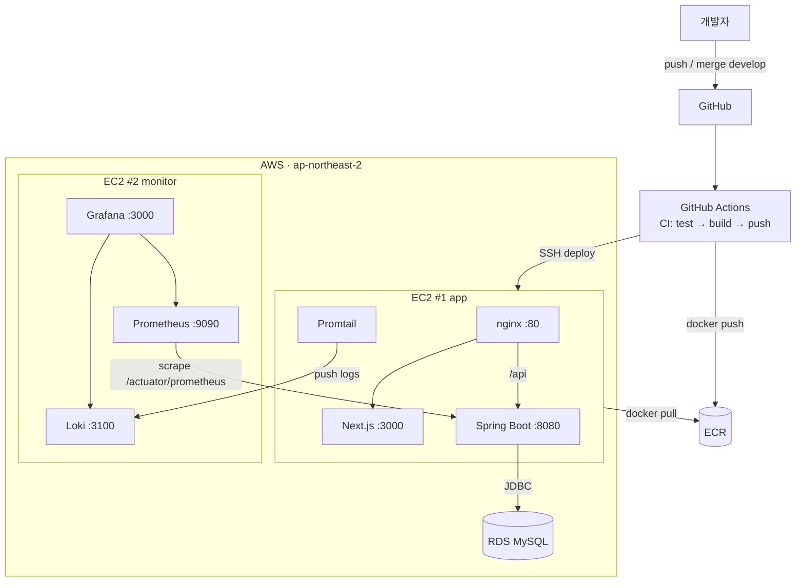

# AWS 배포 & CI/CD 설계 방향

GitHub Actions 기반으로 **develop 머지 → 이미지 빌드(ECR) → EC2 자동 배포**까지 잇는
CI/CD 파이프라인의 **전체 설계 방향** 문서다. 실제 워크플로 파일·compose 분리·런북은
이 방향이 합의된 뒤 후속 문서(06~)에서 다룬다.

> 선행 결정: [README 결정 로그](README.md) — "재개 시 GitHub Actions CI/CD(develop 머지→ECR→EC2)".
> 이 문서는 그 한 줄을 실행 가능한 설계로 구체화한 것이다.

---

## 1. 목표 인프라 (Target)

| 자원 | 역할 | 올라오는 것 |
|---|---|---|
| **EC2 #1 (app)** | 서비스 본체 | nginx · Next.js · Spring Boot (전부 Docker) |
| **EC2 #2 (monitor)** | 관측 | Grafana · Loki · Prometheus |
| **RDS (MySQL)** | 데이터 | MySQL 8 (컨테이너 아님, 관리형) |
| **ECR** | 이미지 레지스트리 | `app`, `next` 이미지 |
| **S3** | 보조 | 빌드 캐시 · 정적 에셋 · 설정 백업 (이미지 저장 아님) |



> **정정 메모**: S3는 오브젝트 스토리지라 `docker pull` 대상이 될 수 없다. 이미지는 **ECR**,
> S3는 빌드 캐시·정적 에셋·백업 등 보조 용도로만 쓴다.

---

## 2. 지금 구조 → AWS 갭 (먼저 닫아야 할 것)

| # | 현재 | AWS에서 필요 | 후속 문서 |
|---|---|---|---|
| ① **DB** | `docker-compose.yml`에 `mysql` 서비스 포함 | RDS 사용 → 앱 compose에서 mysql 제거, `DB_URL`을 RDS 엔드포인트로 | 06 |
| ② **compose 분리** | 파일 1개 + 프로파일(web/observability/edge) | EC2 2대 → `docker-compose.app.yml` / `docker-compose.monitoring.yml` 물리 분리 | 06 |
| ③ **백엔드 빌드** | `backend/Dockerfile`이 **선빌드된 JAR**(`build/libs/*.jar`)를 COPY | CI에서 재현 가능하게 빌드하려면 **멀티스테이지 Dockerfile**(gradle build 포함)로 전환 | 07 |
| ④ **Promtail 위치** | observability 프로파일(모니터 쪽)에 묶임 | 로그는 앱 옆에서 수집 → **Promtail은 EC2#1**, 원격 Loki(EC2#2)로 push | 06 |

③이 핵심 분기점이다. 프론트 Dockerfile은 이미 멀티스테이지라 CI에서 그대로 빌드되지만,
백엔드는 JAR 선빌드를 전제로 해서 CI의 `docker build`가 깨진다.

---

## 3. 파이프라인 설계

### 3.1 원칙 — "CI는 굽고, EC2는 받아서 켜기만"

EC2에서 `docker build` 하지 않는다. 앱 EC2 메모리가 작고(`-Xmx384m`) 서버 빌드는
OOM·서비스 흔들림 위험(→ [01-capacity-planning](01-capacity-planning.md)). **레지스트리 경유**가 정석.

```
push(develop) → Actions[test → build image → push ECR] → EC2[compose pull → up -d]
```

### 3.2 워크플로 분리 + path 필터

| 파일 | 트리거 | 하는 일 |
|---|---|---|
| `ci.yml` | PR (모든) | gradle test (H2 단위/슬라이스). 초록불 게이트 |
| `cd-app.yml` | `develop` push, `backend/**` `frontend/**` 변경 | 변경된 이미지 빌드 → ECR push → EC2#1 배포 |
| `cd-monitoring.yml` | `develop` push, `monitoring/**` 변경 | EC2#2에 monitoring compose 반영 |

> path 필터로 프론트만 고쳤을 때 백엔드까지 재빌드되는 낭비를 막는다.

### 3.3 이미지 태깅 & 롤백

- 이미지는 `:latest` + `:<git-sha>` **둘 다** push.
- EC2의 `.env`에 `IMAGE_TAG=<sha>` 를 두고 compose가 이를 참조.
- 장애 시 `IMAGE_TAG`만 직전 sha로 바꿔 `up -d` = 즉시 롤백.

---

## 4. 결정 사항 (Decision Log)

| 항목 | 결정 | 이유 |
|---|---|---|
| **레지스트리** | **ECR** | 같은 AWS 계정 → EC2 IAM Role로 키 없이 pull. S3는 레지스트리 불가 |
| **배포 접속** | **1차 SSH(`appleboy/ssh-action`) → 목표 SSM** | 빠르게 시작하되, 22포트 미개방·키리스인 SSM으로 승격 |
| **빌드 위치** | **CI에서 빌드, EC2는 pull만** | 마이크로 인스턴스 서버 빌드 금지(OOM) |
| **백엔드 Dockerfile** | **멀티스테이지化** | CI 재현성. JAR 선빌드 의존 제거 |
| **DB** | **RDS** | 관리형. 앱 compose에서 mysql 제거 |
| **시크릿** | **GitHub Secrets → EC2 `.env` 주입** (추후 SSM Parameter Store) | 커밋 금지. `.env.example`로 키 목록만 관리 |
| **브랜치→환경** | 우선 `develop` 단일 환경 | 팀 규모상 staging/prod 분리는 후순위 |

---

## 5. 필요한 GitHub Secrets

| 키 | 용도 |
|---|---|
| `AWS_ACCESS_KEY_ID` / `AWS_SECRET_ACCESS_KEY` | ECR push (또는 OIDC Role로 대체 권장) |
| `AWS_REGION` | `ap-northeast-2` |
| `ECR_REGISTRY` | ECR 레지스트리 주소 |
| `EC2_APP_HOST` / `EC2_MONITOR_HOST` | 배포 대상 호스트 |
| `EC2_SSH_KEY` | **개인키** (분실 시 키페어 재발급 필요 — §7) |
| `RDS_URL` / `DB_USERNAME` / `DB_PASSWORD` | 앱 DB 접속 |
| `JWT_SECRET` | 앱 시크릿 |

> 개인키·DB 비밀번호는 **절대 리포에 커밋 금지**. `.env`는 gitignore 유지.

---

## 6. 네트워크 / 보안그룹 주의점 (자주 놓침)

- **Prometheus(EC2#2) → 앱(EC2#1) 스크레이프**: 타겟은 `localhost`가 아니라
  **EC2#1 프라이빗 IP:8080/actuator/prometheus**. EC2#1 SG에서 **8080은 EC2#2 SG에만 허용**(퍼블릭 개방 X).
- **RDS SG**: 3306은 **EC2#1 SG에서만** 허용.
- **Promtail(EC2#1) → Loki(EC2#2)**: 3100을 EC2#1 SG에만 허용.
- **actuator 노출**: `/actuator/health`는 permitAll, 나머지 actuator 엔드포인트는 내부망/모니터 SG로 제한.

---

## 7. 트러블슈팅 — SSH 개인키 분실

공개키만 AWS에 등록돼 있고 개인키를 분실한 경우:

1. 아직 접속 가능한 세션이 있으면 새 키페어의 공개키를 `~/.ssh/authorized_keys`에 추가.
2. 접속 불가하면 EC2 콘솔에서 **키페어 교체**(또는 인스턴스 스냅샷 → 새 키로 재기동).
3. 확보한 **개인키는 `EC2_SSH_KEY` Secret에만** 저장. 파일로 리포에 두지 않는다.

---

## 8. 실행 로드맵

- [ ] **8-1** 백엔드 `Dockerfile` 멀티스테이지化 + `docker-compose.app.yml`(mysql 제거, RDS 참조) — 문서 06/07
- [ ] **8-2** `ci.yml`: PR 테스트 게이트부터 (배포 없이 초록불 확인)
- [ ] **8-3** ECR 리포 생성 + Actions에서 push 검증 (배포 X)
- [ ] **8-4** EC2#1에 **수동** `docker compose pull && up -d` 1회 성공 (배포 절차 검증)
- [ ] **8-5** 검증된 절차를 `cd-app.yml`로 자동화 (SSH → SSM 승격)
- [ ] **8-6** 모니터링 EC2 연동(`cd-monitoring.yml`) + 스크레이프/로그 경로 확인
- [ ] **8-7** 롤백 리허설(`IMAGE_TAG` 되돌리기) 문서화

---

## 다음 문서 (예정)

| 번호 | 문서 | 내용 |
|---|---|---|
| 06 | `06-compose-split.md` | app / monitoring compose 분리 · RDS 연동 · Promtail 재배치 |
| 07 | `07-cicd-pipeline.md` | 백엔드 멀티스테이지 Dockerfile · ci.yml / cd-app.yml 상세 |
| 08 | `08-secrets-rollback.md` | 시크릿 주입 방식 · 태깅 · 롤백 절차 |
