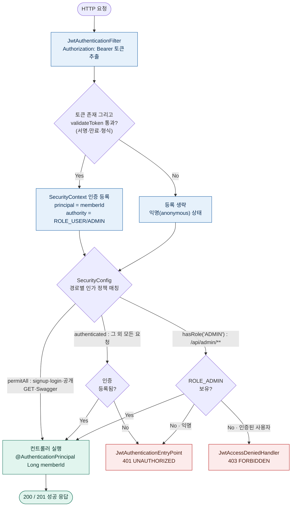
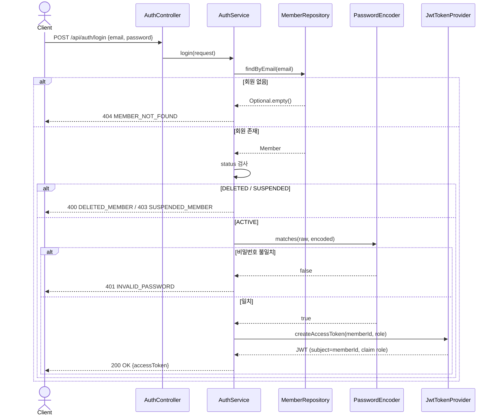

# 인증 / 인가 로직 (Auth & Security)

JWT 기반 **stateless** 인증/인가 구조. 로그인 시 Access Token을 발급하고, 매 요청마다 토큰을 검증해 `SecurityContext`에 인증을 등록한 뒤 URL 정책으로 인가를 판정한다.

> `global/security` 영역은 **팀장만 수정**한다. (`SecurityConfig` 주석 기준)

---

## 구성 요소

| 영역 | 클래스 | 책임 |
| --- | --- | --- |
| 공통 인프라 | `SecurityConfig` | 필터체인, URL 권한정책, `PasswordEncoder`, `AuthenticationManager` |
| | `JwtTokenProvider` | 토큰 발급·검증·파싱 |
| | `JwtAuthenticationFilter` | 매 요청 토큰 검증 → `SecurityContext` 등록 |
| | `JwtAuthenticationEntryPoint` | 미인증 → 401 JSON |
| | `JwtAccessDeniedHandler` | 권한 부족 → 403 JSON |
| 인증 도메인 | `AuthController` / `AuthService` | 회원가입·로그인, 토큰 발급 호출 |
| 권한 모델 | `Member` / `Role` / `MemberStatus` | 사용자 · 권한(`ROLE_USER`/`ROLE_ADMIN`) · 상태 |

- 코드 위치: `backend/src/main/java/com/dongnemarket/global/security/`, `.../auth/`, `.../member/`
- 토큰 설정(`application.yml`): `jwt.secret`(환경변수 `JWT_SECRET`), `jwt.access-token-validity-seconds`(기본 `3600` = 1시간)

---

## ① 매 요청 인증 → 인가 판정

`JwtAuthenticationFilter`가 토큰을 검증해 인증을 등록하고, `SecurityConfig`의 경로별 정책이 인가를 판정한다.

> 같은 "권한 없음"이라도 **익명이면 401, 인증된 사용자면 403**으로 갈린다. Spring Security의 `ExceptionTranslationFilter`가 익명 사용자의 `AccessDeniedException`을 `AuthenticationEntryPoint`(401)로 위임하기 때문이다.

---

## ② 로그인 토큰 발급

`AuthService.login()`의 실패 경로(404 / 400 / 403 / 401)와 성공 경로를 그대로 옮긴 것.

> **회원가입(`POST /api/auth/signup`)은 토큰을 발급하지 않는다**(`201 Created`만 반환). 토큰은 로그인에서만 발급된다.

---

## URL 인가 정책

`SecurityConfig`의 `authorizeHttpRequests` (위 → 아래 순서로 매칭).

| 매처 | 정책 |
| --- | --- |
| `/swagger-ui/**`, `/v3/api-docs/**` 등 | `permitAll` |
| `POST /api/auth/signup`, `/api/auth/login` | `permitAll` |
| `GET /api/products`, `/api/products/{id}`, `/api/categories/**`, `/api/products/{id}/comments` | `permitAll` (공개 조회) |
| `/api/admin/**` | `hasRole('ADMIN')` |
| 그 외 모든 요청 | `authenticated()` |

부가 설정: `csrf` disable, `formLogin`/`httpBasic` disable, `SessionCreationPolicy.STATELESS`, 필터를 `UsernamePasswordAuthenticationFilter` 앞에 등록.

---

## 핵심 규칙

- **인증 주체 = `Long memberId`** — 토큰 `subject`에 `memberId`, claim에 `role`을 담는다. 컨트롤러는 `@AuthenticationPrincipal Long memberId`로 꺼낸다. `UserDetailsService`를 쓰지 않아 매 요청 DB 조회가 없다.
- **401 / 403 모두 공통 `ErrorResponse` JSON**(`{status, error, message, timestamp}`)으로 응답한다 — 컨트롤러 예외(`GlobalExceptionHandler`)와 포맷이 동일하다.
- **필터는 차단하지 않는다** — `JwtAuthenticationFilter`는 토큰이 없거나 invalid해도 그냥 통과시키고(인증 미등록), 실제 차단은 `SecurityConfig` 정책 + `EntryPoint`/`AccessDeniedHandler`가 한다.

---

## 알려진 한계 (개선 후보)

- **권한·상태 변경이 즉시 반영되지 않는다** — `role`과 로그인 가능 여부(`status`)는 로그인 시점에만 확정된다. 발급된 토큰은 만료(1시간) 전까지 유효하므로, 회원을 정지·탈퇴시키거나 권한을 바꿔도 기존 토큰은 계속 통한다.
- **ADMIN 생성 경로가 없다** — `Member.createUser()`는 항상 `ROLE_USER`다. `/api/admin/**` 정책은 있으나 이를 통과할 `ROLE_ADMIN` 계정을 만드는 수단(시드/승격)이 아직 없다.
- **Refresh Token · 로그아웃(토큰 무효화)이 없다** — Access Token 단일 토큰만 존재한다.
- **토큰 실패 원인을 구분하지 않는다** — 만료/위조/누락 모두 401 `UNAUTHORIZED`로 응답한다(`INVALID_TOKEN` 코드는 정의돼 있으나 미사용).
- **운영 배포 시 `JWT_SECRET` 환경변수 주입 필수** — 미주입 시 소스의 dev 기본키로 폴백한다.
