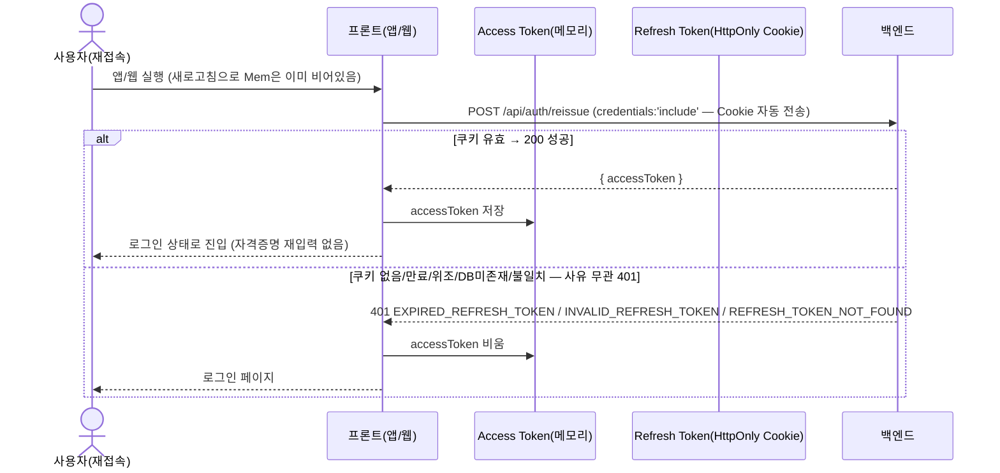
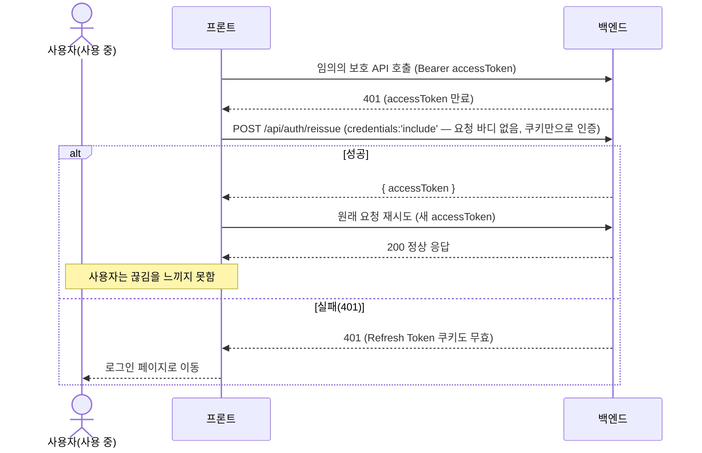

# 자동 로그인(Silent Refresh) 흐름 정리

> 이 문서는 자동 로그인 흐름의 **정책/설계 근거 보조 자료**다. 실제 동작 코드는 `frontend/src/lib/apiClient.ts`(재발급·중복 요청 방지·401 재시도), `frontend/src/components/AuthBootstrap.tsx`(앱 진입 시 자동 로그인 시도), `frontend/src/lib/auth.ts`(Access Token 메모리 보관)에 구현되어 있다. 백엔드 신규 API는 추가하지 않았다 — 기존 `POST /api/auth/login` / `POST /api/auth/reissue` / `POST /api/auth/logout`만으로 충분했다.
>
> **2026-07-03 업데이트**: 최초 구현은 Access/Refresh Token을 모두 `localStorage`에 저장했으나, XSS로 두 토큰이 함께 탈취될 수 있다는 우려로 **Refresh Token은 HttpOnly Cookie, Access Token은 모듈 스코프 메모리 변수**로 전환했다. 아래 내용은 전환 이후 기준으로 갱신되었다.

## 결론 먼저

**자동 로그인 흐름을 위해 새로 추가한 백엔드 API는 없다.**

- `POST /api/auth/reissue`가 이미 `permitAll`이고 `refreshToken`만으로 동작하므로, 앱/웹 재접속 시나리오를 그대로 지원한다.
- `EXPIRED_REFRESH_TOKEN` / `INVALID_REFRESH_TOKEN` / `REFRESH_TOKEN_NOT_FOUND` 모두 `401`로 응답하므로, 프론트는 "reissue가 401이면 로그인 페이지로 이동"이라는 **단일 정책**만 두면 된다(세 코드를 구분해서 다르게 처리할 필요는 없다 — 구분은 로깅/디버깅 용도로만 참고).
- Refresh Token을 회전(rotation)하지 않으므로, 여러 탭이 동시에 `reissue`를 호출해도 서로 충돌하지 않는다.
- 로그아웃(`POST /api/auth/logout`)으로 Refresh Token이 삭제된 경우도 이후 `reissue`가 `REFRESH_TOKEN_NOT_FOUND`를 반환해 같은 정책(로그인 페이지 이동)에 자연스럽게 흡수된다.

선택적 개선안(`accessToken` 만료까지 남은 시간을 응답에 포함하는 `expiresIn` 필드)은 검토했으나 **이번 범위에 포함하지 않는다** — 아래 "검토했지만 이번엔 넣지 않은 개선안" 절 참고.

## 실제 검증 (Playwright, 2026-07-03, Cookie 전환 이후)

로컬 백엔드(`bootRun`) + 프론트(`next dev`)를 띄우고 headless 브라우저로 아래 시나리오를 실제로 구동해 확인했다.

- [x] 토큰이 전혀 없는 상태에서 공개 페이지(`/products`)가 정상 렌더됨(리다이렉트 없음)
- [x] 로그인 후 `localStorage`가 완전히 비어있음(`{}`) — Access/Refresh Token 어느 쪽도 localStorage에 남지 않음
- [x] `refreshToken` 쿠키가 `httpOnly:true`, `sameSite:'Lax'`, `path:'/'`, `secure:false`(로컬 HTTP 기준), `domain:'localhost'`(Host-Only)로 설정됨을 브라우저 쿠키 저장소에서 직접 확인
- [x] 전체 페이지 새로고침(Access Token은 메모리라 소실) 후 보호 페이지(`/my-profile`) 재진입 → `AuthBootstrap`이 쿠키만으로 조용히 재발급해 정상 렌더됨(자동 로그인)
- [x] 보호 페이지에서 실제 액션(닉네임 수정) 실행 → 성공("회원 정보를 수정했어요")
- [x] `refreshToken` 쿠키를 지우고 새로고침 후 보호 페이지 접근 → `/login`으로 리다이렉트됨

---

## 현재 토큰 정책 요약

| 항목 | 값 |
|---|---|
| Access Token 만료 | 15분(900초) |
| Refresh Token 만료 | 7일(604800초) |
| Refresh Token 저장 | 회원당 1개(DB), 재로그인 시 교체 |
| Refresh Token 회전 | 없음 — 재발급해도 쿠키는 재설정되지 않고 그대로 유지 |
| Refresh Token 전달 방식 | HttpOnly Cookie(`refreshToken`, `SameSite=Lax`, `Path=/`, `Secure`는 `auth.cookie.secure` 기반) — JS로 읽을 수 없음. `Max-Age`는 로그인 화면 "자동 로그인" 체크박스에 따라 분기(체크 시 604800초 영속 쿠키, 미체크 시 세션 쿠키) — `docs/postman/auth-refresh-token.md`의 "자동 로그인 체크박스" 절 참고 |
| Access Token 전달/보관 방식 | 로그인/재발급 응답의 JSON `data.accessToken` 필드로 전달, 프론트는 모듈 스코프 메모리 변수에만 보관(localStorage/sessionStorage 미사용) |
| 관련 엔드포인트 | `POST /api/auth/login`(permitAll), `POST /api/auth/reissue`(permitAll, 쿠키만으로 동작), `POST /api/auth/logout`(인증 필요, 쿠키도 만료시킴), `GET /api/members/me`(인증 필요 — 세션 확인 용도로 재사용 가능) |

---

## 시나리오 1 — 앱/웹 재접속 시 자동 로그인

**핵심**: Access Token은 메모리에만 있어 새로고침/앱 재시작으로 항상 사라진다 — 이게 의도된 동작이다. `refreshToken` 쿠키는 HttpOnly라 JS가 존재 여부를 확인할 수 없으므로, 프론트는 존재 여부를 먼저 검사하지 않고 그냥 `reissue`를 호출한다(브라우저가 쿠키를 자동으로 실어 보낸다). 별도의 "세션 확인" 전용 API는 필요 없다 — `reissue` 자체가 그 역할을 겸한다.

---

## 시나리오 2 — 사용 중 Access Token 만료

**핵심**: "보호 API 401 → reissue 1회 시도 → 성공하면 원 요청 재시도, 실패하면 로그인 페이지"라는 인터셉터 패턴은 `frontend/src/lib/apiClient.ts`의 `apiFetch()`로 구현되어 있고, 보호된 페이지들은 raw `fetch` 대신 이 함수를 사용한다.

---

## 시나리오 3 — Refresh Token 만료/삭제/무효 시 로그인 페이지 이동 정책

| 상황 | 백엔드 응답 | 프론트 정책 |
|---|---|---|
| Refresh Token 쿠키 자체가 없음 | 401 `INVALID_REFRESH_TOKEN` | Access Token(메모리) 비우고 로그인 페이지 |
| Refresh Token 만료(7일 경과) | 401 `EXPIRED_REFRESH_TOKEN` | Access Token(메모리) 비우고 로그인 페이지 |
| Refresh Token 위조/형식 오류 | 401 `INVALID_REFRESH_TOKEN` | Access Token(메모리) 비우고 로그인 페이지 |
| Access Token을 reissue에 잘못 제시 | 401 `INVALID_REFRESH_TOKEN` | Access Token(메모리) 비우고 로그인 페이지 |
| 로그아웃 등으로 DB에서 삭제됨 | 401 `REFRESH_TOKEN_NOT_FOUND` | Access Token(메모리) 비우고 로그인 페이지 |
| DB 저장값과 다른(교체된 구) 토큰 | 401 `INVALID_REFRESH_TOKEN` | Access Token(메모리) 비우고 로그인 페이지 |

**정책은 하나로 통일**: 위 6가지 모두 "reissue 실패 → 메모리의 accessToken을 비우고 로그인 페이지로 이동"으로 동일하게 처리한다(Refresh Token 쿠키 자체는 HttpOnly라 프론트가 직접 지울 수 없고, 서버가 만료시키기 전까지는 브라우저가 계속 들고 있다가 다음 시도에서도 같은 사유로 거부된다). 에러 코드별 분기 로직을 프론트에 따로 만들 필요가 없다.

---

## 멀티탭/동시성 관련 참고

- Refresh Token 회전이 없으므로, 여러 탭에서 동시에 `reissue`를 호출해도 서버 쪽에서 충돌이나 예외가 발생하지 않는다(각자 새 `accessToken`만 받아감).
- 다만 한 탭에서 로그아웃하면 다른 탭은 즉시 알 수 없다(백엔드는 상태를 푸시하지 않음) — 다른 탭은 다음 API 호출이나 `reissue` 시점에야 `REFRESH_TOKEN_NOT_FOUND`로 감지한다. 여러 탭 간 즉시 동기화는 이번 범위에 포함하지 않았다(참고만).
- 동시에 여러 API가 401을 받아 각자 `reissue`를 중복 호출하는 것은 백엔드 입장에서 안전하지만, 불필요한 요청을 줄이기 위해 `apiClient.ts`는 진행 중인 reissue 요청을 모듈 스코프의 `Promise`로 공유해 재사용한다(중복 reissue 호출 방지, 실제 구현됨).

---

## 검토했지만 이번엔 넣지 않은 개선안

**`expiresIn`(또는 `accessTokenExpiresAt`) 필드를 로그인/재발급 응답(`AccessTokenResponse`)에 추가하는 안**

- 현재는 프론트가 401을 받은 뒤에야 재발급을 시도하는 **반응형(reactive)** 방식이다. 이 필드가 있으면 만료 전에 미리 갱신을 예약하는 **선제적(proactive)** 방식도 가능해진다.
- 다만 반응형 방식만으로도 시나리오 1~3이 모두 완전히 동작하므로 필수는 아니다. 백엔드 DTO 변경(작은 규모지만 API 응답 계약 변경)이 필요해 별도 PR로 논의 후 진행하는 것을 제안한다.

---

## 제외 범위

- Redis 기반 세션/토큰 저장소 전환
- `expiresIn` 등 API 응답 계약 변경(백엔드 DTO 변경 필요, 별도 PR 제안)
- 멀티탭 간 실시간 로그아웃 동기화
- `Header.tsx`의 로그인/로그아웃 상태 표시 전환(로그인 여부와 무관하게 항상 "로그인" 링크만 보이는 기존 동작은 이번 범위에서 그대로 둠 — 별개의 UX 이슈)
