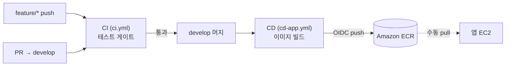

# CI/CD 파이프라인

> 최종 수정일: 2026-07-07 · 상태: draft

GitHub Actions 워크플로우. 정의는 [`.github/workflows/`](../../.github/workflows/).

## CI — `ci.yml` (테스트 게이트)

**트리거**: `feature/*` push(솔로 작업 중 즉시 피드백) · `develop` 대상 PR(머지 전 최종 게이트). `develop` push는 제외(그건 CD 담당). 수동 실행 가능.

| Job | 내용 |
| --- | --- |
| **backend-test** | JDK 21 · `./gradlew test` — **단위/슬라이스 테스트(H2)**. 실패 시 리포트 업로드 |
| **frontend-check** | Node 22 · deps 설치 · **lint · build** |

> 같은 ref의 이전 실행은 자동 취소(러너 낭비 방지). 테스트 계층 전략은 [conventions/testing.md](../conventions/testing.md) 참고.

## CD — `cd-app.yml` (이미지 빌드 & push)

**트리거**: `develop` push 중 `backend/**`·`frontend/**` 변경 시. 수동 실행 가능.

1. **changes** — `dorny/paths-filter`로 어떤 앱이 바뀌었는지 감지(바뀐 것만 빌드).
2. **build-backend / build-frontend** — 변경된 앱 이미지를 빌드해 **ECR로 push**.
   - AWS 인증: **OIDC**(`AWS_ROLE_ARN` 시크릿, `id-token: write` 권한). 정적 키 미사용.
   - 태그: `latest` + 커밋 SHA(`${{ github.sha }}`).
   - 리전: `ap-northeast-2`.

> ⚠️ **현재 CD는 ECR push까지만.** EC2 배포(pull·재기동)는 워크플로우에 없고 수동이다([cloud-deploy.md](cloud-deploy.md) 재배포 절차). 자동 배포 job 추가가 후속 과제.

## 필요한 시크릿 / 설정

| 항목 | 용도 |
| --- | --- |
| `AWS_ROLE_ARN` | GitHub Actions OIDC로 assume할 IAM Role |
| (IAM Role 권한) | ECR push |
| ECR 리포지토리 | `dongnemarket-app` · `dongnemarket-next` |

## 브랜치 전략과의 연결

`feature/*` → (CI 통과) → `develop` PR 머지 → (CD가 ECR push) 흐름. 브랜치·머지 규칙은 [conventions/git-collaboration.md](../conventions/git-collaboration.md).
