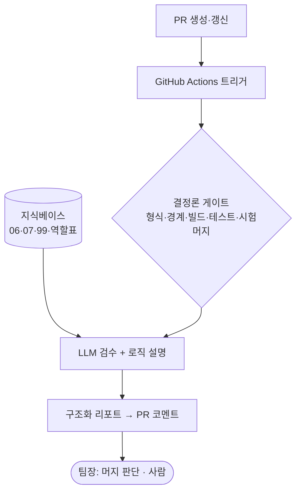

# PRD — PR 검수 자동화 시스템 (가칭 *Merge Captain Auto*)

> **상태** Draft(제안) · **작성** 팀장(jomin4) · **날짜** 2026-06-28
> **관련 문서** `06-integration-agent.md` · `07-daily-pr-summary.md` · `99-ai-review-checklist.md` + 역할 분담표
> **한 줄 요약** 팀원이 PR을 올리면 검수·충돌검사·로직설명이 자동 실행되어 PR에 리포트로 남고, **팀장은 머지 판단만** 한다.

---

## 1. 배경 / 문제
현재는 팀원이 PR을 올리면 팀장이 PR 번호를 LLM에 **수동 전달** → 99 체크리스트 검수·충돌 확인·로직 설명을 받아 머지를 판단한다. 잘 작동하나 (1) 팀장이 매번 트리거해야 하고, (2) PR 본문의 "BUILD SUCCESSFUL" **자기신고에 의존**하며, (3) 검수 이력이 채팅에 흩어져 추적이 어렵다.

## 2. 목표 / 비목표
**목표**
- PR 생성·갱신 시 검수가 **자동 실행**되고, 팀장은 머지 판단만 한다.
- 빌드·테스트·충돌을 **CI가 직접 검증**(자기신고 불신).
- 판정·근거·변경 로직 요약을 PR에 **구조화해 영구 기록**한다.

**비목표 (이번 범위 아님)**
- 자동 머지 / 자동 푸시 / 자동 충돌해결 — 사람 영역 유지.
- 코드 자동 수정·생성.
- 노션 역할 리포트·LLM 위키 — 계속 보류.

## 3. 성공 지표
- PR당 팀장 개입: "번호 전달 + 채팅 검수" → **리포트 읽고 머지 클릭**.
- develop 머지 후 빌드 깨짐 **0건**(시험머지+컴파일 게이트로 사전 차단).
- 검수 리포트 PR당 자동 1건(누락 0).

## 4. 사용자 / 시나리오
- **팀원(구현자)**: 자기 도메인 PR 생성 → 자동 리포트 확인 → 지적사항 수정·재푸시.
- **팀장(검수·통합)**: PR 목록에서 리포트 보고 머지/반려 결정. 충돌·develop 건강성 알림 수신.

## 5. 기능 요구사항 (파이프라인)
| # | 기능 | 상세 | 방식 |
|---|---|---|---|
| F1 | 트리거 | `on: pull_request` (opened·synchronize) | GitHub Actions |
| F2 | 형식 게이트 | 브랜치명 `feature/{도메인}_{기능}`, 커밋 타입, PR 템플릿 | 결정론 |
| F3 | 경계 게이트 | 변경파일 경로 ↔ `owners.yml` 대조, ErrorCode COMMON 침범 검출 | 결정론 |
| F4 | 빌드·테스트 | `./gradlew test` **실제 실행**, develop 기존실패와 분리 | 결정론(CI) |
| F5 | 충돌 게이트 | `mergeable` + develop **시험 머지 후 컴파일** | 결정론(CI) |
| F6 | LLM 검수 | 99 체크리스트 판정(통과/조건부/보류) + 충돌 라우팅 | LLM |
| F7 | 로직 설명 | 변경 파일 요약 + Mermaid 흐름도(학습용) | LLM |
| F8 | 리포트 | F2~F7 → 구조화(JSON) → PR 코멘트 1건 | 템플릿 |

## 6. 아키텍처 (요약)

> 핵심 설계: **결정론 먼저, LLM 나중.** 규칙으로 검사 가능한 건 코드로 거르고 그 결과를 LLM 입력으로 넘겨 판정 품질·일관성·비용을 확보한다.

## 7. 안전장치 / 제약 (06 규칙 계승)
- LLM 단계 토큰 **read-only**(코멘트만), write 권한과 분리.
- main·develop 직접 push 금지 · 자동 머지 금지 · 공통파일 자동수정 금지.
- LLM 판정은 **권고**. 최종 머지는 사람.
- API 키·토큰은 GitHub Actions Secrets.

## 8. 단계적 도입
- **P0** — `owners.yml`(도메인 → 패키지 경로 → 담당자) 작성. 경계 검사의 핵심 입력.
- **P1 (80% 가치)** — F1~F8을 GitHub Actions로 + PR 코멘트 출력. 진짜 알맹이.
- **P2** — 구조화 JSON → 대시보드/Slack, **반복지적 누적 원장**(작성자·도메인별; 예: #18·#32 Validation 누락 추적), 07 일일요약 자동화.

## 9. 리스크 / 대응
| 리스크 | 대응 |
|---|---|
| LLM 판정 흔들림 | 체크리스트 고정 · 저온도 · JSON 스키마 · 사람 최종결정 |
| 비용 / 소음 | synchronize 디바운스, 설명은 변경파일 한정, 모델 분리(opus 검수 / sonnet 설명) |
| 토큰 오남용 | read-only 분리 · Secrets |
| 오탐(false 보류) | 결정론 게이트와 LLM 판정을 분리 표기, 사람이 오버라이드 |

## 10. 미해결 결정 (Open Questions)
1. **실행 주체** — Claude Code GitHub Action(문서 재사용으로 빠름) vs Claude API 직접 호출(통제 큼)?
2. **출력 1순위** — PR 코멘트로 충분한가, 별도 대시보드가 필요한가?
3. **도입 시점** — 팀 기능개발 완료 후(모듈화와 함께)인가, 지금 P1만 선행인가?
