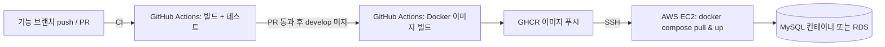

# 10. CI/CD · 배포 도입 조사 (회의 발표용)

> 작성: 팀장 / 조사 기준일 2026-06-29
> 목적: 현재 프로젝트에 **GitHub Actions 기반 CI/CD + AWS 프리티어 배포** 도입.
> 전제: Spring Boot 3.5.15 / Java 21 / Gradle / MySQL, GitHub PR 흐름(기능 브랜치 → `develop` 통합), 5인 팀.

---

## 1. 한 줄 결론 (발표용)

> **PR마다 자동 빌드·테스트(CI)** 로 통합 품질을 지키고, **`develop` 머지 시 Docker 이미지로 AWS EC2에 자동 배포(CD)** 한다.
> 비용은 **GitHub Actions(공개 레포 무료) + AWS 프리티어**로 0에 수렴. 한 번에 다 말고 **3단계로 점진 도입**.

---

## 2. 현재 상태 점검 (이미 갖춰진 것 / 부족한 것)

| 항목 | 현재 | 비고 |
|------|------|------|
| 빌드 도구 | Gradle ✅ | `./gradlew build` 로 CI 가능 |
| 테스트 | 도메인별 단위/통합 테스트 ✅ | CI에서 그대로 실행 |
| 컨테이너 | `backend/docker-compose.yml` 존재 ✅ | 배포에 재활용 |
| 환경변수 주입 | `application.yml`에 `${DB_URL}`, `${JWT_SECRET}` ✅ | **운영 설정 분리 이미 준비됨 (큰 장점)** |
| CI 파이프라인 | ❌ 없음 | 이번에 추가 |
| Dockerfile | ❌ 없음 | 이번에 추가 |
| 헬스체크 | ❌ Actuator 미포함 | 배포 검증용으로 추가 권장 |
| 운영 DDL | `ddl-auto: update` ⚠️ | **운영 전 `validate`로 변경 권장** |

---

## 3. 권장 아키텍처



- **레지스트리**: **GHCR(GitHub Container Registry)** 권장 — GitHub 통합·무료, 별도 Docker Hub 계정 불필요.
- **배포 방식**: GitHub Actions가 EC2에 **SSH 접속 → `docker compose pull && up -d`** (가장 단순·재현 가능).
- **DB 선택 (프리티어)**:
  - **권장(비용 최소)**: EC2 한 대에 **MySQL 컨테이너**를 앱과 함께 `docker compose`로. (RDS 프리티어는 12개월 한정)
  - 대안: **RDS db.t3.micro**(12개월 무료) — 관리 편하지만 기간 후 과금. 포트폴리오면 RDS도 어필 포인트.

---

## 4. 환경 매핑 (브랜치 ↔ 배포)

| 브랜치 | 역할 | 배포 |
|--------|------|------|
| 기능 브랜치 / PR | 개발 | **CI만** (빌드+테스트) |
| `develop` | 통합 | **개발/스테이징 EC2 자동 배포** |
| `main` | 릴리스(선택) | 운영 배포(원하면 분리) |

→ 5인 팀의 현재 흐름(기능 브랜치 → `develop`)에 그대로 얹힘. `develop`을 "살아있는 데모 서버"로 운영 가능.

---

## 5. 도입 자료 (핵심 스니펫)

### 5-1. Dockerfile (멀티스테이지, `backend/Dockerfile`)
```dockerfile
# --- build stage ---
FROM gradle:8.14-jdk21 AS build
WORKDIR /app
COPY . .
RUN gradle clean bootJar --no-daemon

# --- run stage ---
FROM eclipse-temurin:21-jre
WORKDIR /app
COPY --from=build /app/build/libs/*.jar app.jar
EXPOSE 8080
ENTRYPOINT ["java", "-jar", "app.jar"]
```

### 5-2. CI 워크플로 (`.github/workflows/ci.yml`) — PR 빌드+테스트
```yaml
name: CI
on:
  pull_request:
    branches: [develop, main]
jobs:
  build-test:
    runs-on: ubuntu-latest
    steps:
      - uses: actions/checkout@v4
      - uses: actions/setup-java@v4
        with: { distribution: temurin, java-version: '21', cache: gradle }
      - run: ./gradlew build   # 테스트 포함
        working-directory: backend
```

### 5-3. CD 워크플로 (`.github/workflows/cd.yml`) — develop 머지 시 배포
```yaml
name: CD
on:
  push:
    branches: [develop]
jobs:
  deploy:
    runs-on: ubuntu-latest
    steps:
      - uses: actions/checkout@v4
      - uses: docker/login-action@v3
        with:
          registry: ghcr.io
          username: ${{ github.actor }}
          password: ${{ secrets.GITHUB_TOKEN }}
      - uses: docker/build-push-action@v6
        with:
          context: ./backend
          push: true
          tags: ghcr.io/${{ github.repository }}:latest
      - name: Deploy over SSH
        uses: appleboy/ssh-action@v1
        with:
          host: ${{ secrets.EC2_HOST }}
          username: ${{ secrets.EC2_USER }}
          key: ${{ secrets.EC2_SSH_KEY }}
          script: |
            cd ~/dongne-market
            docker compose pull
            docker compose up -d
```

### 5-4. 헬스체크 (배포 검증용)
`build.gradle`에 추가:
```gradle
implementation 'org.springframework.boot:spring-boot-starter-actuator'
```
→ `/actuator/health` 로 무중단 검증, `SecurityConfig` 화이트리스트에 추가.

---

## 6. 보안 (반드시 발표에 포함)

- **시크릿은 코드에 절대 하드코딩 금지.** `JWT_SECRET`, `DB_PASSWORD`, `EC2_SSH_KEY` 등은 **GitHub Secrets**로.
- 현재 `application.yml`이 이미 `${ENV:default}` 패턴이라 **운영 주입 구조는 준비됨** → Secrets만 연결.
- AWS 자격증명은 가능하면 **OIDC federation**(저장된 키 없이 IAM 역할) 사용 — 키 유출 위험 제거.
- EC2 보안그룹: 22(SSH, 배포용), 80/443(HTTP) 최소 개방.

---

## 7. 단계적 도입 로드맵

| 단계 | 내용 | 효과 |
|------|------|------|
| **Phase 1 (CI)** | PR 시 빌드+테스트 자동화 (`ci.yml`) | 통합 품질 보장, 위험 0 |
| **Phase 2 (이미지화)** | Dockerfile + GHCR 이미지 빌드/푸시 | 배포 준비 |
| **Phase 3 (CD)** | EC2 SSH 자동 배포 + 헬스체크 | `develop` 자동 배포 |
| Phase 4 (선택) | `main` 운영 분리, RDS, 도메인/HTTPS | 운영 고도화 |

> 권장: **Phase 1만 먼저** 도입해도 팀 전체 효용 큼(공통구조 담당자=팀장 작업과 잘 맞음). 이후 단계별 확장.

---

## 8. 비용 요약

| 항목 | 비용 |
|------|------|
| GitHub Actions (공개 레포) | 무료(무제한) / 비공개 월 2,000분 |
| GHCR | 공개 이미지 무료 |
| AWS EC2 t2.micro | 12개월 프리티어 무료(월 750시간) |
| RDS db.t3.micro | 12개월 프리티어(또는 MySQL 컨테이너로 회피) |

---

## 9. 참고 자료
- [AWS 공식: GitHub Actions CI/CD → EC2 배포](https://aws.amazon.com/blogs/devops/integrating-with-github-actions-ci-cd-pipeline-to-deploy-a-web-app-to-amazon-ec2/)
- [Deploying Spring Boot to AWS EC2 with Docker & GitHub Actions (DEV)](https://dev.to/yadrs/deploying-spring-boot-to-aws-ec2-with-docker-and-github-actions-the-repeatable-way-55bi)
- [Spring Boot CI/CD with GitHub Actions (2026)](https://medium.com/@rashitutejaa23/spring-boot-ci-cd-pipeline-using-github-actions-production-setup-2026-151c48cbd172)
- [GitHub Actions: Complete CI/CD Guide (2026)](https://techoral.com/automation/github-actions-complete-guide.html)
